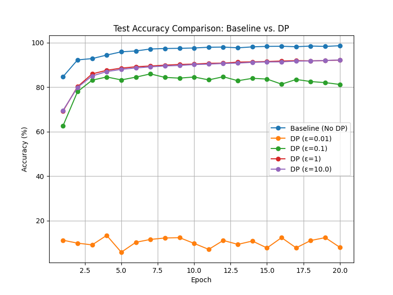

## 1. 摘要
本報告展示了如何在 MNIST 資料集上訓練一個簡單的卷積神經網路（CNN），並利用差分隱私 (Differential Privacy, DP) 技術來保護模型訓練過程中的資料隱私。本實驗採用 DPSGD (Differentially Private Stochastic Gradient Descent) 方法，透過對梯度進行裁剪與加入高斯雜訊來實現隱私保護。實驗中調整了隱私參數 **ε (epsilon)**，並以最終模型的準確率作為效能衡量指標，以比較不同隱私保護強度下模型效能的變化。

## 2. 研究背景與動機
隨著資料隱私保護需求日益增加，差分隱私成為保護訓練資料的重要技術。傳統深度學習在訓練過程中可能會洩漏個別訓練資料的資訊，而 DPSGD 能在每次更新時對梯度添加適當的雜訊，從而降低單筆資料對模型參數更新的影響。**ε (epsilon)** 值控制了雜訊的大小：
- **ε 值越小**：代表需要添加更多噪聲，隱私保護強，但可能導致模型準確率下降。
- **ε 值越大**：則噪聲較少，隱私保護較弱，但模型效能較好。

## 3. 方法論

### 3.1 模型與資料
- **模型架構**：使用一個簡單的 CNN 模型，包括兩層卷積層與兩層全連接層，結合最大池化層與 ReLU 激活函數。
- **資料集**：選用 MNIST 手寫數字資料集，並進行標準化處理。

### 3.2 差分隱私實作
- **梯度擾動**：並非直接對輸入資料進行擾動，而是在每個 mini-batch 的梯度計算後，先對梯度進行裁剪 (clip)，再加上高斯噪聲以實現差分隱私。這種方式確保了在模型參數更新時，每個訓練樣本對最終模型的影響均受到嚴格限制。
- **隱私參數設定**：利用 [Opacus](https://github.com/pytorch/opacus) 工具包的 `make_private_with_epsilon` 方法，自動計算並調整加入的噪聲量。實驗中設定了多組不同的 **ε** 值（如 0.1, 0.5, 1.0, 2.0），以觀察噪聲量增大時對模型準確率的影響。

### 3.3 效果衡量
- **效能指標**：以測試集的分類準確率 (Accuracy) 作為衡量模型效能的指標。
- **隱私水平**：通過設置不同的 **ε (epsilon)** 值，從強隱私保護（低 ε，高噪聲）到弱隱私保護（高 ε，低噪聲）來對比模型表現。

## 4. 實驗設置
- **超參數**：
  - Batch Size: 64
  - Epochs: 5
  - 學習率：0.001（較低以配合較大雜訊）
  - Clipping Norm: 1.0
  - ε 值陣列： [0.1, 0.5, 1.0, 2.0]
- **環境**：使用 PyTorch 框架結合 Opacus 進行 DP 訓練，並利用 logging 模組記錄訓練過程，同時將訓練與比較圖像存檔。

## 5. 實驗結果

### 5.1 結果總結
透過多組不同 ε 值下的實驗結果，可以觀察到：
- **Baseline（無差分隱私）**：通常能夠達到較高的準確率。
- **差分隱私訓練 (DPSGD)**：
  - 當 **ε 值較小**：由於加入大量噪聲，模型學習效果受限，準確率明顯下降。
  - 當 **ε 值較大**：噪聲量較少，模型準確率較接近 Baseline，但隱私保護效果降低。

### 5.2 圖像展示

#### Baseline 與 DP 比較曲線

*該圖對比了無差分隱私的 Baseline 與各個 ε 值下的 DP 模型在各個 epoch 的準確率走勢。*
